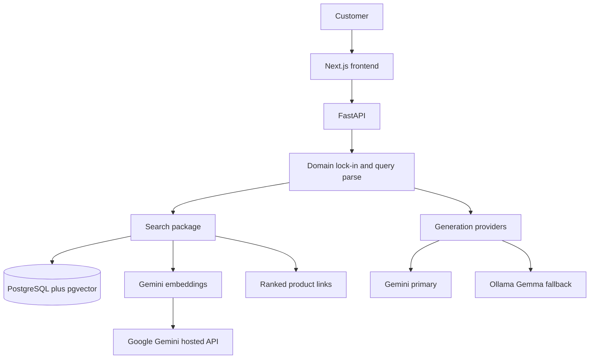

# AI Fashion Search

A production-style conversational shopping assistant. A customer describes an outfit or product in natural language and receives ranked catalog results as clickable links. The assistant can ask a clarifying question, or accept extra detail the customer adds on their own. It only answers fashion-catalog questions.

The stack runs end to end against hosted Neon PostgreSQL. Catalog browsing, Gemini embeddings, pgvector semantic search, PostgreSQL full-text keyword search, and RRF hybrid ranking are available.

## Target user

An Indian online shopper who knows what they want in words, not filters: color, occasion, budget, category, and vibe. They expect INR prices and product links they can open and review. They may refine the request in a follow-up message instead of starting over.

MVP language is English (Hinglish can come later). The catalog is synthetic or openly licensed. This project does not scrape Myntra or any other retailer.

## Core journey

1. The customer types a request, for example: *Show me a black outfit for an evening wedding under ₹4,000* or *black check shirt under 2000 rupees for a wedding*.
2. The system decides whether the message is on-domain (fashion catalog search). Off-topic messages are declined.
3. On-domain queries are parsed into structured filters: color, category, price ceiling, occasion, and related attributes.
4. If the query is too vague to search well (missing category and occasion, conflicting constraints, or “something nice”), the assistant asks one clarifying question and waits.
5. If the customer volunteers more detail without being asked, that turn is merged into the same session filters and search runs again.
6. Matching products are retrieved (keyword + vector, then ranked) and returned as clickable catalog links with title, price, and image.
7. The assistant stays in this loop until the customer is done browsing. It never switches into a general chatbot.

## Domain lock-in

The assistant is a catalog shopper, not a general LLM.

- It answers only questions that can be served from this fashion catalog (products, outfits, size/color/occasion/price filters, “show similar”).
- It declines weather, news, coding, homework, medical, legal, and any other off-topic request.
- It does not invent products that are not in the catalog.
- It does not give styling lectures disconnected from retrieval. Any style comment is grounded in returned items.

## MVP scope

- Next.js frontend and FastAPI backend.
- Single database: PostgreSQL with pgvector (vectors) and PostgreSQL full-text search (keywords).
- Product embeddings via **Google Gemini only** (hosted API; no local model weights).
- Response generation: Gemini when quota is available, Gemma via Ollama as the local fallback.
- Versioned prompt files (not hardcoded strings).
- Synthetic or openly licensed catalog; INR prices; placeholder product URLs.
- Conversational turns: clarification questions and voluntary follow-ups.
- Strict domain guard.

## Non-goals

- Scraping or cloning Myntra, Amazon, or any retailer.
- Checkout, payments, carts, or live inventory.
- User accounts, personalization, or order history.
- Image-to-search or visual similarity (later, if ever).
- Multi-retailer aggregation or affiliate networks.
- Local embedding models (Sentence Transformers, Hugging Face, Ollama embeddings).

## Success measures

- Ranked results for budget and occasion queries feel relevant (color, category, price, occasion match the request).
- Ambiguous queries get a single clarifying question instead of a random dump.
- Off-topic queries are refused clearly and briefly.
- Product cards are clickable links a shopper can review.
- `/health` is green; the UI loads the shopping shell.

## Architecture



| Layer | Choice |
| --- | --- |
| UI | Next.js App Router |
| API | FastAPI |
| Catalog + keyword search | PostgreSQL |
| Vector storage | pgvector on Neon |
| Embeddings | Google Gemini (`gemini-embedding-001`, 768 dims) |
| Generation | Gemini primary, Ollama Gemma fallback |
| Prompts | Versioned files under `backend/src/fashion_search/prompts/versions/` |

Backend packages live under `backend/src/fashion_search/`: `api`, `catalog`, `search`, `embeddings`, `generation`, `prompts`, `config`, `core`.

## Roadmap

| Phase | Focus |
| --- | --- |
| **Day 1** | Scaffold: packages, README, health check, placeholder UI. |
| **Day 2** | Neon connectivity, Compose for API + UI, catalog models/migrations, synthetic seed catalog, browse UI. |
| **Day 3** | Gemini embeddings, pgvector semantic search, PostgreSQL FTS, hybrid RRF search (done). Next: conversational session + UI wiring. |
| **Day 4** | Conversational session, filter extraction, clarification turns, domain lock-in, Gemini/Ollama generation. |
| **Day 5** | UI for chat + product links, ranking polish, error paths, review against success measures. |

## Explainable hybrid ranking

Hybrid results preserve cosine similarity, PostgreSQL `ts_rank_cd`, both source
ranks, weighted RRF score, final rank, retrieval sources, and exact constraints
verified against structured product fields. RRF scores and cosine similarities
are ranking signals, not probabilities or confidence percentages.

Each result receives a deterministic `match_reason` and a configurable quality:

- `strong`: all hard constraints match and either both retrieval channels have
  meaningful evidence or semantic similarity reaches the strong threshold.
- `good`: all hard constraints match and at least one configured semantic,
  keyword, or dual-channel signal is present.
- `weak`: retrieval evidence is below those thresholds. A hard-constraint
  violation is always weak as a defensive measure, though SQL filtering should
  prevent such a product from being returned.

Thresholds are configured with `SEARCH_STRONG_SEMANTIC_THRESHOLD`,
`SEARCH_WEAK_SEMANTIC_THRESHOLD`, and `SEARCH_MIN_KEYWORD_SIGNAL`. Explanations
use parsed constraints, structured product metadata, and existing retrieval
signals only; descriptions are never used to assert exact attributes and no
explanation-time Gemini call is made.

Empty constrained searches return `no_exact_matches` when aggregate counts prove
the hard filters eliminated every product. If products satisfy the filters but
neither retrieval channel returns them, the status is `no_relevant_matches`.
If diagnostics are disabled or unavailable, the neutral `no_results` status is
used rather than making an unsupported claim. Filters are never relaxed.
Unsupported price currencies return `unsupported_constraints` instead of
claiming that the catalog has no matching products.
When enabled, one aggregate diagnostic query computes progressive and
leave-one-filter-out counts and emits only suggestions supported by those
counts. There are no per-result database queries.

## Local run

Catalog data lives in **Neon** (PostgreSQL + pgvector). Docker Compose runs only the backend and frontend containers — not Postgres.

```bash
cp .env.example .env
# Set DATABASE_URL (Neon, sslmode=require) and GEMINI_API_KEY for embeddings.
docker compose up --build
```

- API health: http://localhost:8000/health (backend + Neon ping)
- Catalog: http://localhost:3000/catalog
- Product API: http://localhost:8000/products
- Embeddings CLI: `embed-catalog` (see [Product embeddings](#product-embeddings-gemini))
- Conversational hybrid search: `POST /search`; stateless hybrid search: `POST /search/hybrid` (see [Hybrid search](#hybrid-search))
- Semantic search: `POST /search/semantic` (see [Semantic search](#semantic-search-pgvector))
- Constraint parsing: `POST /search/parse` (see [Fashion constraint extraction](#fashion-constraint-extraction))

Without Docker:

```bash
# API
cd backend
python3.12 -m venv .venv
source .venv/bin/activate
pip install -e .
alembic upgrade head
uvicorn fashion_search.main:app --reload

# UI (separate terminal)
cd frontend
npm install
npm run dev
```

Enable the vector extension on Neon before embeddings or retrieval depend on it:

```sql
CREATE EXTENSION IF NOT EXISTS vector;
```

## Product embeddings (Gemini)

Embeddings use **Google Gemini only** (`google-genai`). No Sentence Transformers, Hugging Face, or local model weights are downloaded or executed.

### Dependencies

Installed with the backend package:

- `google-genai`
- existing PostgreSQL + `pgvector` stack

### Environment

```bash
# Required for live embedding runs
GEMINI_API_KEY=...
# Optional alias if GEMINI_API_KEY is empty
GOOGLE_API_KEY=...

EMBEDDING_PROVIDER=gemini
EMBEDDING_MODEL=gemini-embedding-001
EMBEDDING_DIMENSIONS=768
EMBEDDING_BATCH_SIZE=16
EMBEDDING_MAX_RETRIES=3
EMBEDDING_STALE_PROCESSING_MINUTES=30
```

Apply the schema migration (widens `products.embedding` to 768 dims and adds state columns):

```bash
cd backend
source .venv/bin/activate
alembic upgrade head
```

### How embeddings work

1. **Normalize** catalog fields into deterministic text (title, category, color, material, style, occasion, gender, description). Price, sizes, IDs, and stock are excluded.
2. **Hash** the normalized text with SHA-256.
3. **Skip** products whose hash, model, dimensions, provider, and COMPLETED status already match.
4. Mark **PROCESSING**, call Gemini `embed_content` with `task_type=RETRIEVAL_DOCUMENT` and `output_dimensionality=768`, L2-normalize the vector, then persist on `products`.
5. Mark **COMPLETED** or **FAILED** (with `embedding_error`). Stale PROCESSING rows older than `EMBEDDING_STALE_PROCESSING_MINUTES` are recovered as FAILED and retried on the next run.

Vectors are stored on `products.embedding` (unbounded `vector`; Gemini currently
uses 768 dimensions). Generation status is tracked on the same row. Approximate
ANN indexes (HNSW) are **not** used yet — the ~750-product catalog uses exact
cosine distance (`<=>`).

## AI provider architecture

Generation and embeddings use separate application contracts. Provider selection
is centralized in `fashion_search.ai.factory`; search, constraint parsing, and
catalog indexing receive provider interfaces and do not select Gemini or Ollama.
Both contracts have synchronous methods (matching the existing FastAPI and CLI
services) plus `asyncio.to_thread` async wrappers for asynchronous callers.

`GenerationProvider` exposes text generation, Pydantic-validated structured
generation, model identity, and lightweight health. `EmbeddingProvider` exposes
document batches, query embeddings, provider/model/dimension identity, and
health. Provider-native errors are translated to application-level errors.

Example configurations:

```env
# Gemini for both capabilities (default)
GENERATION_PROVIDER=gemini
EMBEDDING_PROVIDER=gemini

# Local Ollama for both capabilities
GENERATION_PROVIDER=ollama
OLLAMA_GENERATION_MODEL=gemma2:9b
EMBEDDING_PROVIDER=ollama
OLLAMA_EMBEDDING_MODEL=nomic-embed-text
OLLAMA_EMBEDDING_DIMENSIONS=768

# Local generation with the existing Gemini vector index
GENERATION_PROVIDER=ollama
EMBEDDING_PROVIDER=gemini

# Optional generation-only failover
GENERATION_PROVIDER=gemini
GENERATION_FALLBACK_PROVIDER=ollama
```

Ollama must already be running and the configured models must already exist.
The application never starts Ollama or downloads models.

Embedding spaces are identified by provider, model, and dimensions. All three
must match before pgvector search runs. Changing `EMBEDDING_PROVIDER`, its model,
or dimensions makes an existing index incompatible; run `alembic upgrade head`
and then `embed-catalog` to rebuild product vectors. The provider-agnostic
schema uses unbounded `vector` storage so models may have different dimensions.
Until a compatible index exists, hybrid search skips query embedding and safely
returns keyword-filtered results with `search_mode=keyword_fallback`,
`semantic_search_available=false`, and an explicit `embedding_index_status`.
It never sends an Ollama query vector into a Gemini vector space.

Provider tests use mocked HTTP/SDK clients and require neither live Gemini nor
Ollama:

```bash
cd backend
.venv/bin/python -m unittest tests.test_providers -v
```

### CLI

```bash
cd backend
source .venv/bin/activate

# Inspect only — no Gemini calls, no DB writes for embeddings
embed-catalog --dry-run

# Limit how many products are inspected
embed-catalog --dry-run --limit 50

# Generate / refresh embeddings
embed-catalog
embed-catalog --limit 100 --batch-size 16
```

Dry-run reports `inspected`, `required`, `skipped`, `failed` (eligible retry / empty text), and `embedded` (always 0).

### Verify

```bash
# Unit tests mock Gemini; they do not consume API credits
cd backend
python -m unittest discover -s tests -v

# After a live run, check Neon
# SELECT id, embedding_status, embedding_model, embedding_dimensions,
#        embedding_text_hash IS NOT NULL AS has_hash,
#        embedding IS NOT NULL AS has_vector
# FROM products ORDER BY id LIMIT 20;
```

Example normalized text:

```text
Classic Black Slim Fit Shirt. Category: shirt. Color: black. Material: cotton. Style: slim fit. Occasion: office. Gender: men. A slim fit shirt in black, made from cotton.
```

Example metadata columns after a successful run:

| column | example |
| --- | --- |
| embedding_provider | gemini |
| embedding_model | gemini-embedding-001 |
| embedding_dimensions | 768 |
| embedding_status | COMPLETED |
| embedding_text_hash | 64-char SHA-256 hex |

## Semantic search (pgvector)

Natural-language queries are embedded with Gemini (`RETRIEVAL_QUERY`) and ranked against stored product vectors (`RETRIEVAL_DOCUMENT`) using **cosine similarity**:

```text
similarity = 1 - (embedding <=> query_embedding)
```

Only rows with `embedding_status = COMPLETED`, `embedding_provider = gemini`, and matching `embedding_model` / `embedding_dimensions` are searched.

### Prerequisites

1. `CREATE EXTENSION IF NOT EXISTS vector;` (applied by Alembic migration `20261007_0001`).
2. `alembic upgrade head`
3. Generate product embeddings: `embed-catalog` (needs `GEMINI_API_KEY`)
4. Confirm coverage:

```sql
SELECT count(*) FILTER (WHERE embedding_status = 'COMPLETED' AND embedding IS NOT NULL) AS ready,
       count(*) AS total
FROM products;
```

### Endpoint

`POST /search/semantic`

Request:

```json
{
  "query": "red cotton shirt for men",
  "limit": 10
}
```

Response (scores are illustrative):

```json
{
  "query": "red cotton shirt for men",
  "total": 2,
  "embedding_model": "gemini-embedding-001",
  "embedding_dimensions": 768,
  "results": [
    {
      "product_id": 123,
      "title": "Heritage Red Slim Fit Shirt",
      "category": "shirt",
      "color": "red",
      "material": "cotton",
      "style": "slim fit",
      "gender": "men",
      "occasion": "casual",
      "price_inr": 1299,
      "currency": "INR",
      "image_reference": "catalog/....webp",
      "product_url": "/products/heritage-red-slim-fit-shirt-0123",
      "similarity_score": 0.92
    }
  ]
}
```

Raw embedding vectors and internal hash/error fields are never returned.

### Indexing decision

| Catalog size | Strategy |
| --- | --- |
| Current (~750) | Exact cosine order (`ORDER BY embedding <=> query`) — no HNSW |
| Larger catalogs later | Consider `USING hnsw (embedding vector_cosine_ops)` after measuring latency |

### Tests

```bash
cd backend
source .venv/bin/activate
python -m unittest discover -s tests -v
```

Unit tests mock Gemini. DB integration tests inject deterministic vectors and do not call the live Gemini API.

### Known limitations

- Semantic-only endpoint does not apply parsed hard filters.
- Hybrid semantic path still needs COMPLETED Gemini embeddings; keyword path works without them.
- No result caching layer.

## Hybrid search

`POST /search/hybrid` performs a stateless hybrid search. `POST /search` uses the
same retrieval path and adds conversational state/refinement.

Both endpoints combine:

1. Gemini + deterministic **constraint parsing** (hard SQL filters).
2. **Semantic** retrieval (`RETRIEVAL_QUERY` + pgvector cosine similarity).
3. **Keyword** retrieval (PostgreSQL `websearch_to_tsquery` + `ts_rank_cd`).
4. **Reciprocal Rank Fusion** (default `k=60`, weights `0.6` semantic / `0.4` keyword).

Hard filters (category, color, occasion, gender, size, INR price bounds) are applied inside both retrieval queries before ranking.

### PostgreSQL full-text search

Weighted `search_vector` on `products` (maintained by trigger on insert/update):

| Weight | Fields |
| --- | --- |
| A | `title` |
| B | `category` |
| C | `color`, `material`, `style` |
| D | `description` |

Migration `20261008_0004` adds the trigger, backfill, and GIN index `products_search_vector_gin_idx`. The catalog has no separate `brand` or `subcategory` columns; those weights are omitted.

### Retrieval query preprocessing

When explicit INR prices are extracted, price phrases are stripped from the text used for semantic/keyword retrieval (for example `black dress under ₹4000` → `black dress`).

### Example

```json
POST /search/hybrid
{
  "query": "black dress under ₹4000 for wedding",
  "limit": 10
}
```

Response includes `filters`, `retrieval_query`, per-result `scores` (`hybrid_score`, ranks, semantic similarity), and `metrics` (latencies, candidate counts, `fallback` when only one path succeeded).

### Failure behavior

- Gemini/embeddings unavailable → keyword-only fallback when FTS succeeds.
- Keyword/FTS failure → semantic-only fallback when embeddings succeed.
- Both paths fail → HTTP 503 (not a silent empty search).

### Configuration

| Variable | Default |
| --- | --- |
| `HYBRID_RRF_K` | 60 |
| `HYBRID_SEMANTIC_WEIGHT` | 0.6 |
| `HYBRID_KEYWORD_WEIGHT` | 0.4 |
| `HYBRID_CANDIDATE_LIMIT` | 100 |

Rankings are starting defaults; evaluate with representative fashion queries before tuning weights.

## Conversational search refinement

Start a session with `POST /search`:

```json
{"query":"black dress under ₹4000 for wedding","limit":10}
```

The response includes `session_id`, `revision`, validated `state`, and deterministic
`active_filters`. Refine it by sending the returned revision:

```json
{"session_id":"…","expected_revision":0,"message":"make it blue","limit":10}
```

Filter chips use the same reducer without synthesizing text:

```json
{"session_id":"…","expected_revision":1,"updates":[{"field":"occasion","operation":"REMOVE"}]}
```

State is structured and delta-based; unmentioned constraints remain unchanged.
Simple colors, sizes, genders, explicit price bounds/removals, category changes, and
price comparisons are handled deterministically before provider interpretation.
`cheaper` and `more expensive` preserve all hard bounds and order the retrieved
candidate set by catalog price ascending or descending respectively; they never
invent a price threshold. Semantic phrases such as `more casual` are appended to
the preserved semantic retrieval query rather than converted to unsupported filters.

Sessions are stored in a locked in-process store for this milestone. Optimistic
revision checks return HTTP 409 for stale writes. State survives zero-result searches,
but it does not survive process restarts and is not shared across multiple API workers.

## AI and search observability

Application-level telemetry is stored in PostgreSQL after migration
`20261009_0006`. Provider events and search events are separate and joined through
`search_request_id`. Provider wrappers record the actual provider/model, operation,
monotonic latency, normalized outcome, fallback status, reliable native token usage,
and configurable estimated API cost. Search events record total latency, hybrid-stage
timings, candidate/result counts, execution mode, and degradation state.

Raw prompts, provider responses, credentials, headers, and API keys are never stored.
Search text is represented by SHA-256 only unless
`OBSERVABILITY_STORE_RAW_QUERIES=true` is explicitly enabled.

Developer endpoints:

- `GET /dev/observability/summary?range=24h`
- `GET /dev/observability/providers?range=24h&provider=gemini`
- `GET /dev/observability/search?range=24h&search_mode=HYBRID`
- `GET /dev/observability/requests/{request_id}`

The dashboard is at `/dev/observability` in the frontend. API dashboard routes return
404 when `APP_ENVIRONMENT=production`, or when observability/dashboard access is
disabled. No application authentication system currently exists, so production access
is intentionally unavailable rather than protected by an ad-hoc credential scheme.

Pricing is optional and versioned configuration rather than embedded source-code truth:

```bash
OBSERVABILITY_PRICING_JSON='{"models":[{"provider":"gemini","model":"configured-model","input_cost_per_million_tokens":"...","output_cost_per_million_tokens":"...","currency":"USD","effective_date":"YYYY-MM-DD"}]}'
```

Unknown pricing stays null. Ollama API cost also stays null because local compute cost
is outside this milestone. Remove expired records manually or from an existing scheduler:

```bash
cleanup-observability
```

Retention defaults to `OBSERVABILITY_RETENTION_DAYS=30`. Search-stage timings are
currently sequential, but total latency also includes orchestration and database work,
so stage values are not expected to sum exactly to the total.

## Fashion constraint extraction

`POST /search/parse` turns an English fashion query into validated constraints while
preserving the original query. Constraint parsing and database filtering are separate:
this endpoint does **not** apply the returned fields to semantic or catalog retrieval.

### Architecture

1. FastAPI validates a non-blank query of at most 500 characters.
2. Gemini receives the versioned `system_query_parse` prompt and a Pydantic response
   schema through `GenerateContentConfig(response_mime_type="application/json",
   response_schema=FashionSearchConstraints)`.
3. Pydantic rejects negative or inverted prices. Deterministic normalization maps only
   supported metadata and aliases.
4. A small regex parser replaces Gemini on API, timeout, JSON, or schema failure.
5. Explicit deterministic price expressions are always compared with Gemini output and
   win on disagreement. Logs contain query length, method, latency, and error type—not
   query contents, provider responses, or credentials.

The configured provider is Google Gemini only. The parser defaults to
`gemini-2.5-flash-lite`, temperature `0`, a 10-second SDK HTTP timeout, and one bounded
retry for transient failures. A valid Gemini result containing all null fields remains a
Gemini success.

### Schema and normalization

`FashionSearchConstraints` contains `category`, `color`, `occasion`, `size`, `gender`,
`price_min`, `price_max`, `currency`, `price_min_inclusive`, and
`price_max_inclusive`. Prices use `Decimal` to avoid binary floating-point errors.
Currency defaults from `MARKET_CURRENCY` (`INR` for this catalog). Missing fields stay
null, and gender is never inferred from category.

Canonical categories, occasions, sizes, and genders come from the catalog generator.
Examples include `tees -> t-shirt`, `kurti -> kurta`, `trainers/sneakers -> footwear`,
`navy -> navy blue`, `male -> men`, and `female -> women`. Search colors also include
the acceptance vocabulary `red`, `blue`, and `gray`; these may have no matches in the
current deterministic seed palette. Unsupported values are left null, while the
unaltered query remains available to semantic retrieval.

The fallback recognizes complete words/phrases for catalog categories, colors,
occasions, explicit genders, and sizes introduced by `size`. This prevents a bare number
such as `32` from being treated as either price or size without context. It supports:

- `under`/`below`/`less than` as a strict maximum
- `up to`/`at most` as an inclusive maximum
- `above`/`over`/`more than` as a strict minimum
- `at least` as an inclusive minimum
- `between … and …` and `from … to …` as inclusive ranges
- `₹`, `Rs.`, `INR`, rupees, commas, decimals, and `k`

Approximate prices such as “around ₹2000” do not become arbitrary hard bounds.
Negative, reversed, or multiple conflicting bounds are safely discarded. The fallback
is intentionally narrow; typo recovery beyond structured catalog terms is left to
semantic search and Gemini.

### API example

```http
POST /search/parse
Content-Type: application/json

{"query":"black dress under ₹4000 for wedding"}
```

```json
{
  "query": "black dress under ₹4000 for wedding",
  "constraints": {
    "category": "dress",
    "color": "black",
    "occasion": "wedding",
    "size": null,
    "gender": null,
    "price_min": null,
    "price_max": "4000",
    "currency": "INR",
    "price_min_inclusive": null,
    "price_max_inclusive": false
  },
  "extraction_method": "gemini"
}
```

Depending on the Pydantic/FastAPI JSON encoder version, `Decimal` values may be emitted
as JSON numbers rather than strings; clients should accept either exact representation.

### Configuration and tests

```bash
SEARCH_PARSER_MODEL=gemini-2.5-flash-lite
SEARCH_PARSER_TEMPERATURE=0
SEARCH_PARSER_TIMEOUT_SECONDS=10
SEARCH_PARSER_MAX_RETRIES=1
MARKET_CURRENCY=INR

cd backend
source .venv/bin/activate
python -m unittest tests/test_constraint_extraction.py -v
python -m unittest discover -s tests -v

# Optional and billable; standard tests always mock Gemini.
RUN_GEMINI_INTEGRATION=1 python -m unittest \
  tests.test_constraint_extraction.LiveGeminiConstraintTests -v
```

Known limitations: English is the current MVP language; approximate budgets are not
represented; unsupported terminology remains only in the semantic query; and parsed
`POST /search` and `POST /search/hybrid` apply parsed constraints as hard SQL filters during retrieval.
