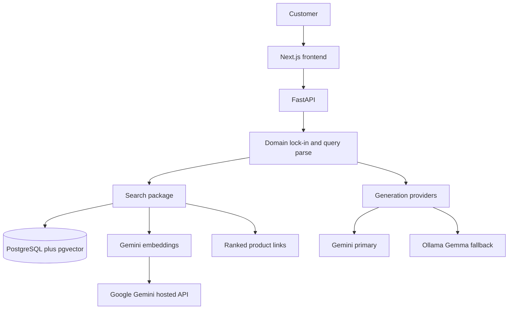

# AI Fashion Search

A production-style conversational shopping assistant. A customer describes an outfit or product in natural language and receives ranked catalog results as clickable links. The assistant can ask a clarifying question, or accept extra detail the customer adds on their own. It only answers fashion-catalog questions.

The stack runs end to end against hosted Neon PostgreSQL. Catalog browsing and Gemini product embeddings are available. Keyword/vector search and generation are not implemented yet.

## Target user

An Indian online shopper who knows what they want in words, not filters: color, occasion, budget, category, and vibe. They expect INR prices and product links they can open and review. They may refine the request in a follow-up message instead of starting over.

MVP language is English (Hinglish can come later). The catalog is synthetic or openly licensed. This project does not scrape Myntra or any other retailer.

## Core journey

1. The customer types a request, for example: *Show me a black outfit for an evening wedding under ₹4,000* or *black check shirt under 2000 rupees for a wedding*.
2. The system decides whether the message is on-domain (fashion catalog search). Off-topic messages are declined.
3. On-domain queries are parsed into structured filters: color, category, price ceiling, occasion, and related attributes.
4. If the query is too vague to search well (missing category and occasion, conflicting constraints, or “something nice”), the assistant asks one clarifying question and waits.
5. If the customer volunteers more detail without being asked, that turn is merged into the same session filters and search runs again.
6. Matching products are retrieved (keyword + vector, then ranked) and returned as clickable catalog links with title, price, and image.
7. The assistant stays in this loop until the customer is done browsing. It never switches into a general chatbot.

## Domain lock-in

The assistant is a catalog shopper, not a general LLM.

- It answers only questions that can be served from this fashion catalog (products, outfits, size/color/occasion/price filters, “show similar”).
- It declines weather, news, coding, homework, medical, legal, and any other off-topic request.
- It does not invent products that are not in the catalog.
- It does not give styling lectures disconnected from retrieval. Any style comment is grounded in returned items.

## MVP scope

- Next.js frontend and FastAPI backend.
- Single database: PostgreSQL with pgvector (vectors) and PostgreSQL full-text search (keywords).
- Product embeddings via **Google Gemini only** (hosted API; no local model weights).
- Response generation: Gemini when quota is available, Gemma via Ollama as the local fallback.
- Versioned prompt files (not hardcoded strings).
- Synthetic or openly licensed catalog; INR prices; placeholder product URLs.
- Conversational turns: clarification questions and voluntary follow-ups.
- Strict domain guard.

## Non-goals

- Scraping or cloning Myntra, Amazon, or any retailer.
- Checkout, payments, carts, or live inventory.
- User accounts, personalization, or order history.
- Image-to-search or visual similarity (later, if ever).
- Multi-retailer aggregation or affiliate networks.
- Local embedding models (Sentence Transformers, Hugging Face, Ollama embeddings).

## Success measures

- Ranked results for budget and occasion queries feel relevant (color, category, price, occasion match the request).
- Ambiguous queries get a single clarifying question instead of a random dump.
- Off-topic queries are refused clearly and briefly.
- Product cards are clickable links a shopper can review.
- `/health` is green; the UI loads the shopping shell.

## Architecture



| Layer | Choice |
| --- | --- |
| UI | Next.js App Router |
| API | FastAPI |
| Catalog + keyword search | PostgreSQL |
| Vector storage | pgvector on Neon |
| Embeddings | Google Gemini (`gemini-embedding-001`, 768 dims) |
| Generation | Gemini primary, Ollama Gemma fallback |
| Prompts | Versioned files under `backend/src/fashion_search/prompts/versions/` |

Backend packages live under `backend/src/fashion_search/`: `api`, `catalog`, `search`, `embeddings`, `generation`, `prompts`, `config`, `core`.

## Roadmap

| Phase | Focus |
| --- | --- |
| **Day 1** | Scaffold: packages, README, health check, placeholder UI. |
| **Day 2** | Neon connectivity, Compose for API + UI, catalog models/migrations, synthetic seed catalog, browse UI. |
| **Day 3** | Gemini product embeddings (done). Next: keyword + vector retrieval, hybrid ranking, search API. |
| **Day 4** | Conversational session, filter extraction, clarification turns, domain lock-in, Gemini/Ollama generation. |
| **Day 5** | UI for chat + product links, ranking polish, error paths, review against success measures. |

## Local run

Catalog data lives in **Neon** (PostgreSQL + pgvector). Docker Compose runs only the backend and frontend containers — not Postgres.

```bash
cp .env.example .env
# Set DATABASE_URL (Neon, sslmode=require) and GEMINI_API_KEY for embeddings.
docker compose up --build
```

- API health: http://localhost:8000/health (backend + Neon ping)
- Catalog: http://localhost:3000/catalog
- Product API: http://localhost:8000/products
- Embeddings CLI: `embed-catalog` (see [Product embeddings](#product-embeddings-gemini))

Without Docker:

```bash
# API
cd backend
python3.12 -m venv .venv
source .venv/bin/activate
pip install -e .
alembic upgrade head
uvicorn fashion_search.main:app --reload

# UI (separate terminal)
cd frontend
npm install
npm run dev
```

Enable the vector extension on Neon before embeddings or retrieval depend on it:

```sql
CREATE EXTENSION IF NOT EXISTS vector;
```

## Product embeddings (Gemini)

Embeddings use **Google Gemini only** (`google-genai`). No Sentence Transformers, Hugging Face, or local model weights are downloaded or executed.

### Dependencies

Installed with the backend package:

- `google-genai`
- existing PostgreSQL + `pgvector` stack

### Environment

```bash
# Required for live embedding runs
GEMINI_API_KEY=...
# Optional alias if GEMINI_API_KEY is empty
GOOGLE_API_KEY=...

EMBEDDING_PROVIDER=gemini
EMBEDDING_MODEL=gemini-embedding-001
EMBEDDING_DIMENSIONS=768
EMBEDDING_BATCH_SIZE=16
EMBEDDING_MAX_RETRIES=3
EMBEDDING_STALE_PROCESSING_MINUTES=30
```

Apply the schema migration (widens `products.embedding` to 768 dims and adds state columns):

```bash
cd backend
source .venv/bin/activate
alembic upgrade head
```

### How embeddings work

1. **Normalize** catalog fields into deterministic text (title, category, color, material, style, occasion, gender, description). Price, sizes, IDs, and stock are excluded.
2. **Hash** the normalized text with SHA-256.
3. **Skip** products whose hash, model, dimensions, provider, and COMPLETED status already match.
4. Mark **PROCESSING**, call Gemini `embed_content` with `task_type=RETRIEVAL_DOCUMENT` and `output_dimensionality=768`, L2-normalize the vector, then persist on `products`.
5. Mark **COMPLETED** or **FAILED** (with `embedding_error`). Stale PROCESSING rows older than `EMBEDDING_STALE_PROCESSING_MINUTES` are recovered as FAILED and retried on the next run.

Vector indexing / similarity search is **not** implemented in this milestone; generation status is tracked independently of any future index.

### CLI

```bash
cd backend
source .venv/bin/activate

# Inspect only — no Gemini calls, no DB writes for embeddings
embed-catalog --dry-run

# Limit how many products are inspected
embed-catalog --dry-run --limit 50

# Generate / refresh embeddings
embed-catalog
embed-catalog --limit 100 --batch-size 16
```

Dry-run reports `inspected`, `required`, `skipped`, `failed` (eligible retry / empty text), and `embedded` (always 0).

### Verify

```bash
# Unit tests mock Gemini; they do not consume API credits
cd backend
python -m unittest discover -s tests -v

# After a live run, check Neon
# SELECT id, embedding_status, embedding_model, embedding_dimensions,
#        embedding_text_hash IS NOT NULL AS has_hash,
#        embedding IS NOT NULL AS has_vector
# FROM products ORDER BY id LIMIT 20;
```

Example normalized text:

```text
Classic Black Slim Fit Shirt. Category: shirt. Color: black. Material: cotton. Style: slim fit. Occasion: office. Gender: men. A slim fit shirt in black, made from cotton.
```

Example metadata columns after a successful run:

| column | example |
| --- | --- |
| embedding_provider | gemini |
| embedding_model | gemini-embedding-001 |
| embedding_dimensions | 768 |
| embedding_status | COMPLETED |
| embedding_text_hash | 64-char SHA-256 hex |

