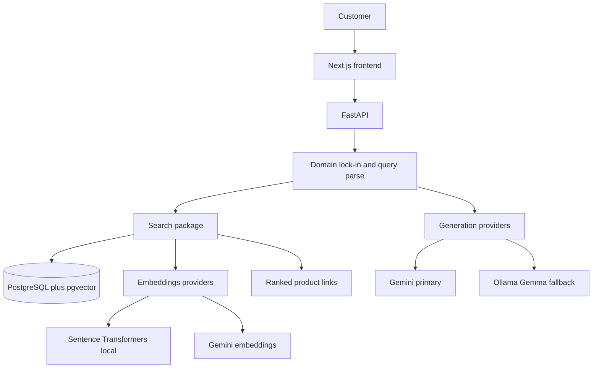

# AI Fashion Search

A production-style conversational shopping assistant. A customer describes an outfit or product in natural language and receives ranked catalog results as clickable links. The assistant can ask a clarifying question, or accept extra detail the customer adds on their own. It only answers fashion-catalog questions.

Day 1 is a scaffold: folder structure, documented contracts, a FastAPI health check, and a Next.js placeholder page. Search and generation are not implemented yet.

## Target user

An Indian online shopper who knows what they want in words, not filters: color, occasion, budget, category, and vibe. They expect INR prices and product links they can open and review. They may refine the request in a follow-up message instead of starting over.

MVP language is English (Hinglish can come later). The catalog is synthetic or openly licensed. This project does not scrape Myntra or any other retailer.

## Core journey

1. The customer types a request, for example: *Show me a black outfit for an evening wedding under ₹4,000* or *black check shirt under 2000 rupees for a wedding*.
2. The system decides whether the message is on-domain (fashion catalog search). Off-topic messages are declined.
3. On-domain queries are parsed into structured filters: color, category, price ceiling, occasion, and related attributes.
4. If the query is too vague to search well (missing category and occasion, conflicting constraints, or “something nice”), the assistant asks one clarifying question and waits.
5. If the customer volunteers more detail without being asked, that turn is merged into the same session filters and search runs again.
6. Matching products are retrieved (keyword + vector, then ranked) and returned as clickable catalog links with title, price, and image.
7. The assistant stays in this loop until the customer is done browsing. It never switches into a general chatbot.

## Domain lock-in

The assistant is a catalog shopper, not a general LLM.

- It answers only questions that can be served from this fashion catalog (products, outfits, size/color/occasion/price filters, “show similar”).
- It declines weather, news, coding, homework, medical, legal, and any other off-topic request.
- It does not invent products that are not in the catalog.
- It does not give styling lectures disconnected from retrieval. Any style comment is grounded in returned items.

## MVP scope

- Next.js frontend and FastAPI backend.
- Single database: PostgreSQL with pgvector (vectors) and PostgreSQL full-text search (keywords).
- Local Sentence Transformers embeddings, with a Gemini embedding provider behind the same interface.
- Response generation: Gemini when quota is available, Gemma via Ollama as the local fallback.
- Versioned prompt files (not hardcoded strings).
- Synthetic or openly licensed catalog; INR prices; placeholder product URLs.
- Conversational turns: clarification questions and voluntary follow-ups.
- Strict domain guard.

## Non-goals

- Scraping or cloning Myntra, Amazon, or any retailer.
- Checkout, payments, carts, or live inventory.
- User accounts, personalization, or order history.
- Image-to-search or visual similarity (later, if ever).
- Multi-retailer aggregation or affiliate networks.
- Implementing retrieval or generation on Day 1.

## Success measures

- Ranked results for budget and occasion queries feel relevant (color, category, price, occasion match the request).
- Ambiguous queries get a single clarifying question instead of a random dump.
- Off-topic queries are refused clearly and briefly.
- Product cards are clickable links a shopper can review.
- `/health` is green; the UI loads the shopping shell.

## Architecture



| Layer | Choice |
| --- | --- |
| UI | Next.js App Router |
| API | FastAPI |
| Catalog + keyword search | PostgreSQL |
| Vector search | pgvector |
| Embeddings | Sentence Transformers (local), Gemini (provider) |
| Generation | Gemini primary, Ollama Gemma fallback |
| Prompts | Versioned files under `backend/src/fashion_search/prompts/versions/` |

Backend packages live under `backend/src/fashion_search/`: `api`, `catalog`, `search`, `embeddings`, `generation`, `prompts`, `config`, `core`.

## Roadmap

| Phase | Focus |
| --- | --- |
| **Day 1** | This scaffold: packages, README, health check, placeholder UI. No search or generation logic. |
| **Day 2** | Postgres + pgvector, catalog models/migrations, synthetic seed catalog. |
| **Day 3** | Embeddings, keyword + vector retrieval, hybrid ranking, search API. |
| **Day 4** | Conversational session, filter extraction, clarification turns, domain lock-in, Gemini/Ollama generation. |
| **Day 5** | UI for chat + product links, ranking polish, error paths, review against success measures. |

## Local run (Day 1)

Database is not required until Day 2. Compose is included so the target store is documented.

```bash
# API
cd backend
python3.12 -m venv .venv
source .venv/bin/activate
pip install -e .
uvicorn fashion_search.main:app --reload

# UI (separate terminal)
cd frontend
npm install
npm run dev
```

- API health: http://localhost:8000/health
- UI: http://localhost:3000
- Optional Postgres: `docker compose up -d` from the repo root.

Copy `.env.example` to `backend/.env` when you start wiring config.
